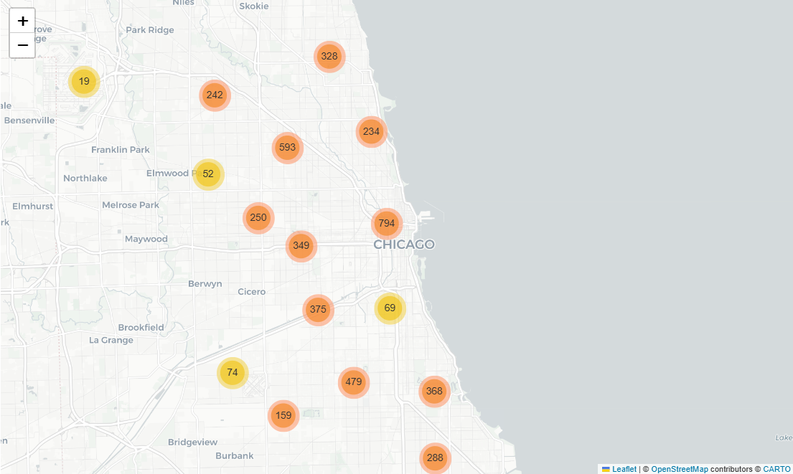
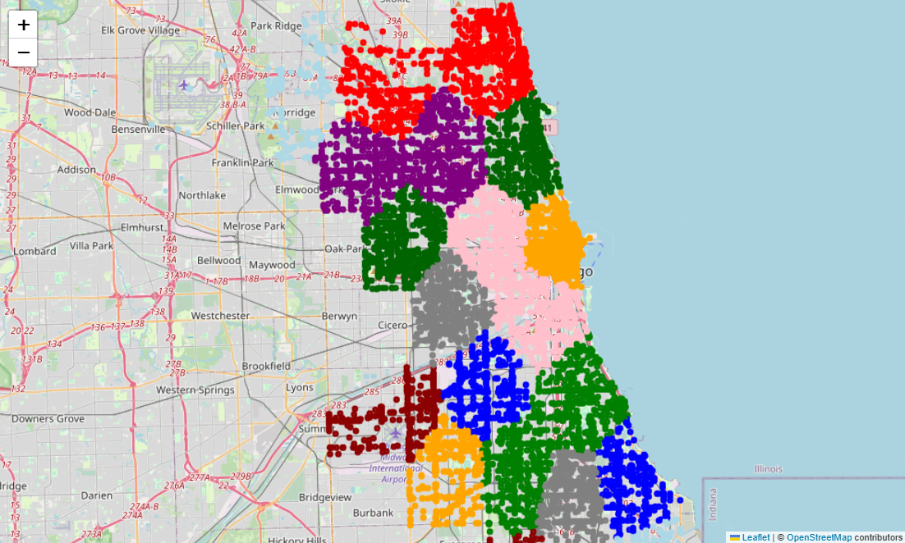

#  Chicago Traffic Crash Analysis — A PySpark-Based Big Data Project

This project explores patterns and contributing factors in traffic crashes across Chicago using **PySpark**, **big data processing**, and **machine learning techniques**. Leveraging real-world data from the [City of Chicago Data Portal](https://data.cityofchicago.org/), we built a scalable pipeline to analyze urban traffic safety at scale.

##  Overview

Traffic safety is a growing urban concern. Our goal is to analyze crash trends in Chicago to uncover high-risk behaviors, time windows, and contributing factors—using big data tools to handle the volume and complexity of the data.

**Key tools & technologies:**
- Apache Spark & PySpark (for distributed processing)
- Hadoop HDFS (data storage layer)
- Spark MLlib (for predictive modeling)
- Matplotlib & Seaborn (for visualization)
- Jupyter Notebook

## Data Source

- **Dataset**: [Traffic Crashes - Crashes | City of Chicago Data Portal](https://data.cityofchicago.org/Transportation/Traffic-Crashes-Crashes/85ca-t3if)
- **Size**: Over 1.1 million crash records
- **Storage**: Loaded and stored on HDFS, processed using PySpark

## Pipeline Summary

1. **Data Ingestion**: Load CSV crash data into Spark DataFrames
2. **Preprocessing**:
   - Parse timestamps, extract hour/day/month/season
   - Create severity indicators based on injury columns
   - Handle missing values and encode categorical variables
3. **Exploratory Analysis**:
   - Analyze crash patterns by time, weather, road, and driver behavior
   - Identify top contributing causes and visualize trends
4. **Predictive Modeling**:
   - Classify crash severity using PySpark ML models
5. **Visualization**: Display trends and hotspots using Matplotlib and Seaborn

## Key Insights

- **Top contributing factors**:
  - Failure to yield right of way
  - Following too closely
  - Improper overtaking/passing
  - Failing to reduce speed
  - Improper lane usage

- **Temporal patterns**:
  - Crash frequency peaks during morning and evening rush hours
  - Afternoon (3–6 PM) shows highest crash rates
  - Early morning hours (2–5 AM) see the lowest activity

## Recommendations

Based on the insights, we suggest:

- **Targeted driver education** on high-risk behaviors
- **Increased enforcement** during peak crash hours
- **Engineering improvements** at intersections with frequent right-of-way violations
- **Data-driven interventions** using continued monitoring via big data analytics

## Future Work

- Geo-spatial crash hotspot analysis
- Integration with weather, traffic volume, or construction data
- Real-time crash severity prediction system

